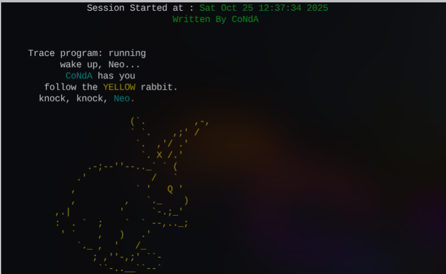
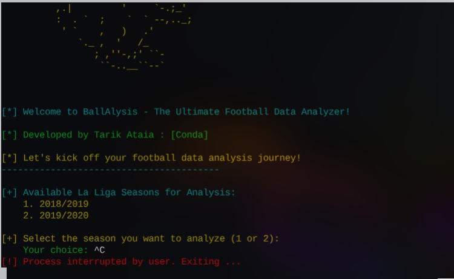

# ⚽ Team Analyzer

**Team Analyzer** is a Python-based interactive CLI tool designed to fetch, process, and analyze football match data from a public API.  

It combines clean data presentation with a visually engaging terminal interface for a smoother user experience.  

The project has been successfully **deployed on Heroku** and is fully operational.

> 🧾 **Note on Project Structure:**  

> The project consists of three main Python files:

> - `banners.py` → An old file reused and updated to enhance the **user experience (UX)** through terminal banners and colored messages.  

While not essential to the core logic, it enhances the visual and interactive aspects of the tool.  

> - `analyzer.py` → Contains the **main analytical logic**, API handling, and data processing.  

> - `run.py` → Acts as the **entry point**, managing execution flow and user interaction.

>

> The focus of the technical evaluation should mainly be on `analyzer.py` and `run.py`,  

> as they represent the functional backbone of the application.

---

## Table of contents "Placeholder" 

---

## 🧩 Overview

**Team Analyzer** fetches football match data, processes it using **Pandas**, and displays it with a clean CLI interface.  

It’s designed to be both informative and easy to use, providing a starting point for football data analytics.  

---

## Reminders

- Your code must be placed in the `run.py` file
- Your dependencies must be placed in the `requirements.txt` file
- Do not edit any of the other files or your code may not deploy properly

## Creating the Heroku app

When you create the app, you will need to add two buildpacks from the _Settings_ tab. The ordering is as follows:

1. `heroku/python`
2. `heroku/nodejs`

You must then create a _Config Var_ called `PORT`. Set this to `8000`

If you have credentials, such as in the Love Sandwiches project, you must create another _Config Var_ called `CREDS` and paste the JSON into the value field.

Connect your GitHub repository and deploy as normal.

## Constraints

The deployment terminal is set to 80 columns by 24 rows. That means that each line of text needs to be 80 characters or less otherwise it will be wrapped onto a second line.

---

Happy coding!
