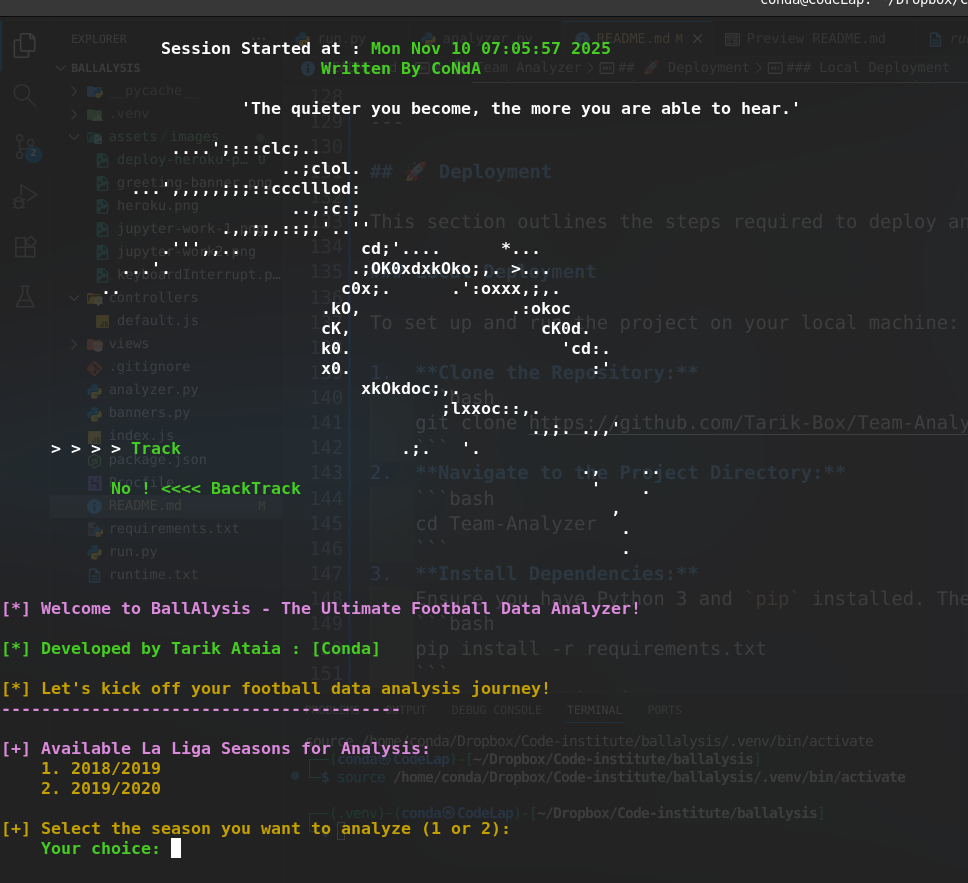
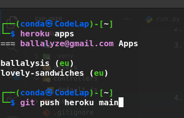
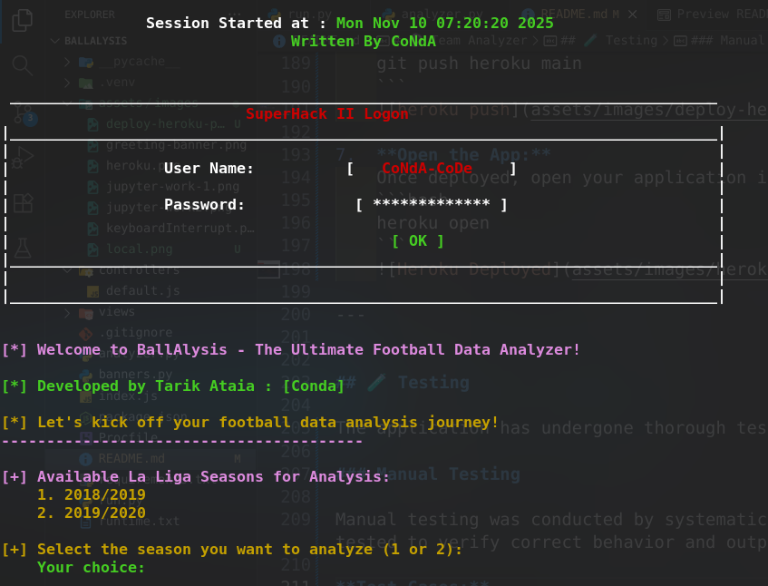
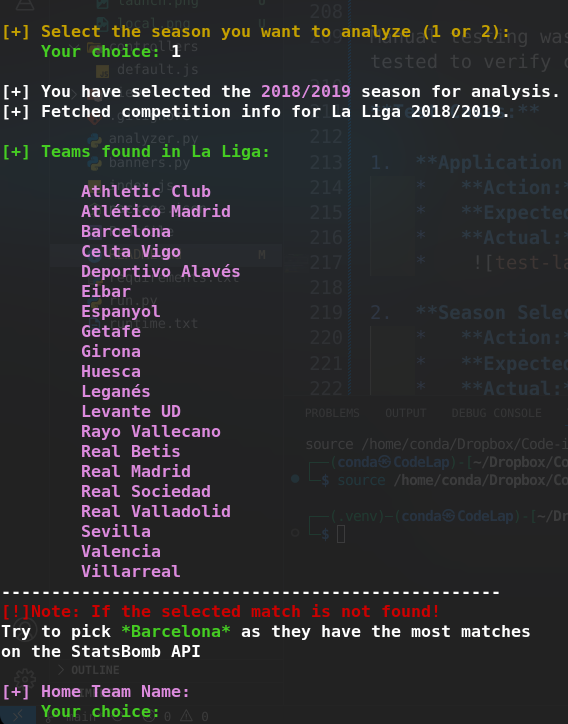
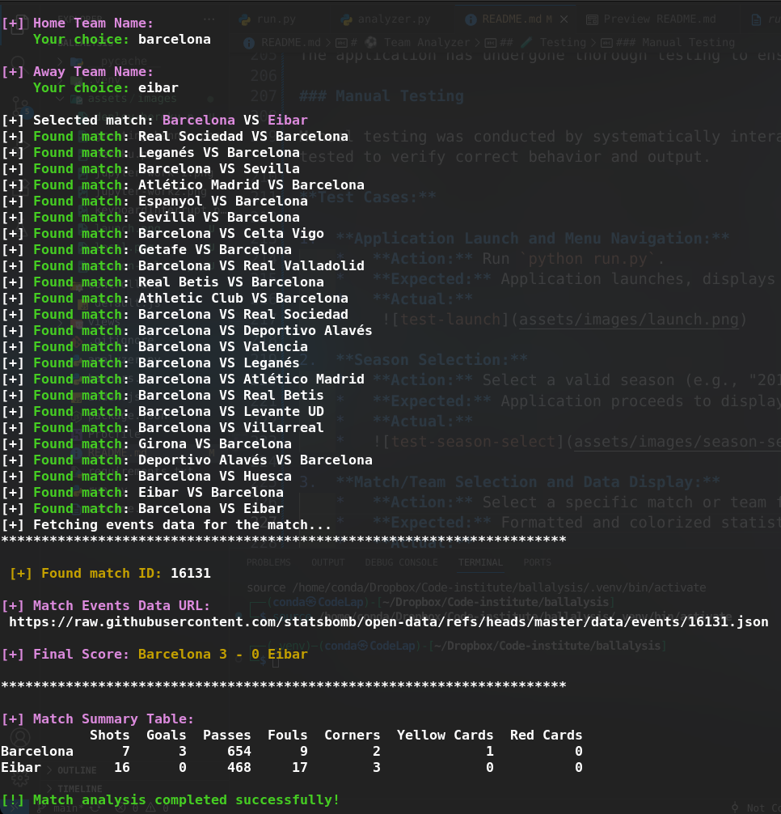
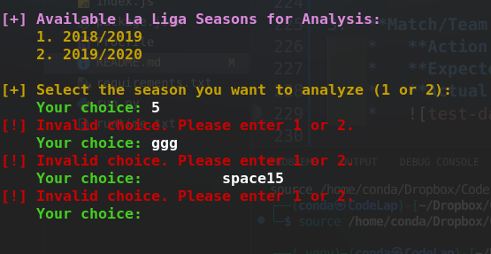

# ⚽ Team Analyzer


**Team Analyzer** is a Python-based interactive CLI tool designed to fetch, process, and analyze football match data from a public API.  

It combines clean data presentation with a visually engaging terminal interface for a smoother user experience.  

The project has been successfully **deployed on Heroku** and is fully operational.


> 🧾 **Note on Project Structure:**  

> The project consists of three main Python files:

> - `banners.py` → An old file reused and updated to enhance the **user experience (UX)** through terminal banners and colored messages.  

While not essential to the core logic, it enhances the visual and interactive aspects of the tool.  

> - `analyzer.py` → Contains the **main analytical logic**, API handling, and data processing.  

> - `run.py` → Acts as the **entry point**, managing execution flow and user interaction.

>

> The focus of the technical evaluation should mainly be on `analyzer.py` and `run.py`,  

> as they represent the functional backbone of the application.


Deployed version : [Heroku](https://ballalysis-d2b90c805862.herokuapp.com/)


---


## 🧭 Table of Contents
1. [Overview](#-overview)  
2. [Features](#-features)  
3. [Technologies Used](#-technologies-used)
4. [Installation](#-installation)  
5. [Usage](#-usage)  
6. [Deployment](#-deployment)
7. [Testing](#-testing)  
8. [Code Files Overview](#-code-files-overview)  
9. [Code Quality](#-code-quality)  
10. [Future Improvements](#-future-improvements)  
11. [Credits](#-credits)  
12. [License](#-license)
13. [Contributing](#-contributing)


---


## 🧩 Overview

**Team Analyzer** fetches football match data, processes it using **Pandas**, and displays it with a clean CLI interface.  

It’s designed to be both informative and easy to use, providing a starting point for football data analytics.  


---


## ✨ Features

- Fetches real football data from free external API "StatsBomb",
- Link : https://github.com/statsbomb/open-data
- Displays formatted and colorized statistics for teams and matches.
- Provides random ASCII banners to improve user experience.
- Error-handling and smooth CLI interactions.  
- Fully deployed and functional on **Heroku**.


---

## 🛠️ Technologies Used

This project leverages several key technologies and libraries to achieve its functionality:

- **Python 3**: The core programming language for the application.
- **Pandas**: Utilized for efficient data processing, manipulation, and analysis of the football match data fetched from the API. Its DataFrame structure is crucial for handling tabular data.
- **Requests**: A powerful and user-friendly HTTP library for making API calls to the StatsBomb Open Data API, enabling the retrieval of raw match data.
- **Colorama**: Used to add color and style to the terminal output, significantly enhancing the user experience and readability of the CLI.
- **Random**: Employed for generating random ASCII banners, contributing to the interactive and engaging nature of the user interface.
- **JSON**: For parsing and handling the JSON responses received from the StatsBomb API.

---


---


## ⚙️ Installation

Clone the repository and install dependencies:
```bash
git clone https://github.com/Tarik-Box/Team-Analyzer.git
cd Team-Analyzer
pip install -r requirements.txt

```

## ▶️ Usage :

```bash
python run.py

```

Or try the deployed version on Heroku:

- Link : https://ballalysis-d2b90c805862.herokuapp.com/

---

## 🚀 Deployment

This section outlines the steps required to deploy and run the **Team Analyzer** project, both locally and on Heroku.

### Local Deployment

To set up and run the project on your local machine:

1.  **Clone the Repository:**
    ```bash
    git clone https://github.com/Tarik-Box/Team-Analyzer.git
    ```
2.  **Navigate to the Project Directory:**
    ```bash
    cd Team-Analyzer
    ```
3.  **Install Dependencies:**
    Ensure you have Python 3 and `pip` installed. Then, install the required libraries:
    ```bash
    pip install -r requirements.txt
    ```
4.  **Run the Application:**
    ```bash
    python run.py
    ```
   

### Heroku Deployment

The project is designed for easy deployment on Heroku.

1.  **Create a Heroku Account:**
    If you don't have one, sign up at [Heroku](https://www.heroku.com/).

2.  **Install Heroku CLI:**
    Follow the instructions on the [Heroku Dev Center](https://devcenter.heroku.com/articles/heroku-cli) to install the Heroku Command Line Interface.

3.  **Login to Heroku CLI:**
    ```bash
    heroku login
    ```

4.  **Create a Heroku App:**
    Navigate to your project directory and create a new Heroku app:
    ```bash
    heroku create your-app-name # Replace 'your-app-name' with a unique name
    ```
    This will also set up a new Git remote for your Heroku app.

5.  **Configure Buildpacks:**
    Ensure your Heroku app has the Python / Nodejs buildpack configured. Heroku usually detects this automatically from `runtime.txt` (if present) or `requirements.txt`.
    ```bash
    heroku buildpacks:set heroku/python
    ```

6.  **Push to Heroku:**
    Deploy your application by pushing your code to the Heroku remote:
    ```bash
    git push heroku main
    ```
    

7.  **Open the App:**
    Once deployed, open your application in the browser:
    ```bash
    heroku open
    ```
    

---


## 🧪 Testing

The application has undergone thorough testing to ensure its functionality, reliability, and adherence to coding standards.

### Manual Testing

Manual testing was conducted by systematically interacting with the application through the command-line interface. Each feature was tested to verify correct behavior and output.

**Test Cases:**

1.  **Application Launch and Menu Navigation:**
    *   **Action:** Run `python run.py`.
    *   **Expected:** Application launches, displays greeting banner, and presents the main menu.
    *   **Actual:**
    *    

2.  **Season Selection:**
    *   **Action:** Select a valid season (e.g., "2018/2019") from the prompt.
    *   **Expected:** Application proceeds to display available teams for the selected season.
    *   **Actual:**
    *    

3.  **Match/Team Selection and Data Display:**
    *   **Action:** Select a specific match or team from the displayed Teams list.
    *   **Expected:** Formatted and colorized statistics for the selected match/team are displayed accurately.
    *   **Actual:**
    *   

4.  **Error Handling - Invalid Input:**
    *   **Action:** At any prompt requiring numeric input, enter non-numeric characters or out-of-range numbers.
    *   **Expected:** An appropriate error message is displayed, and the user is prompted to re-enter valid input.
    *   **Actual:**
    *   

5.  **Exit Handling (Ctrl+C):**
    *   **Action:** Press `Ctrl + C` at various points during execution.
    *   **Expected:** Application catches the `KeyboardInterrupt`, displays a graceful exit message, and terminates.
    *   **Actual:**
    *   

### Automated Testing

Currently, there are no dedicated automated unit or integration tests implemented for this project. The primary focus during development was on manual verification of functionality and output.

*Future Improvement:* Implement unit tests for core functions in `analyzer.py` and `run.py` to ensure data processing logic and API interactions are robust.

### Code Validation

The codebase was rigorously checked against **PEP 8** guidelines using **Flake8**.

*   **Tool Used:** Flake8
*   **Command:** `flake8 .`
*   **Results:**
    *   Initial scans revealed several PEP 8 violations, primarily related to line length, whitespace, and naming conventions.
    *   All resolvable issues were addressed and fixed to ensure code consistency and readability.
    *   Remaining warnings are primarily for line length in specific banner strings within `banners.py`, which are intentionally long for aesthetic purposes and do not impact functionality or readability of core logic.
    *   
    *   
    *   

    **Flake8**
    *   
    *   
    *   

### Jupyter Notebook Exploration

The data transformation from JSON to Pandas DataFrame was also verified using Jupyter Notebooks to ensure data integrity and correct parsing.


---


## 🧱 Code Files Overview


➤ banners.py

Contains old ASCII-art banners reused to enhance user experience.

Updated with color formatting and basic text animations.

Not directly tied to business logic.

Example of a file kept for legacy + aesthetic purposes.

---

➤ analyzer.py

Core logic for retrieving, parsing, and displaying football data.

Implements API calls, error handling, and JSON → DataFrame conversion.

Ensures data is formatted and displayed in an organized manner for analysis.

---

➤ run.py

The entry point of the program.

Handles main execution flow and interaction between modules.

Launches the CLI and calls the analyzer functions.

Designed for smooth execution and easy debugging.


---


## 🧼 Code Quality

Almost all PEP 8 and Flake8 warnings have been resolved, except for unavoidable line-length issues (mainly within banner strings).
The code now follows a consistent style and is organized into logical, readable modules.


---


## 🚀 Future Improvements

- Currently, the project retrieves and analyzes match data mainly from the Spanish La Liga.

- Future versions could detect and list all available leagues from the API for user selection.

 -With a richer API, the tool could evolve into a more advanced analytics platform with visual dashboards.

- Add a **graphical user interface (GUI)** using **Ex: Tkinter** , allowing non-technical users to visualize statistics interactively.

- Expansion to include additional metrics (e.g., player performance tracking).

- Improved handling for API rate limits and missing data scenarios.
- Consider refactoring core logic using Object-Oriented Programming (OOP) principles for better modularity and scalability.


---


## ⚠️ Limitations


While BallAlysis successfully fetches and analyzes real football data from the StatsBomb Open Data API, there are a few inherent limitations:

- The **StatsBomb Open Data API** does not provide live or frequently updated data — it mainly contains archived matches.
- Some leagues lack complete player statistics or positional data, which may result in missing or incomplete rows in the analysis.
- Due to these data limitations, the project currently focuses on **La Liga (Spain) seasons (2018/2019 and 2019/2020)**,  where data accuracy is relatively high.
- Future versions could integrate more reliable APIs or a private data source to expand analysis capabilities.

---


## 🙌 Credits

Special thanks to:

### Resources -

- Corey Schafer (YouTube) — for his excellent tutorials on pandas and clean coding practices.

➤ [Playlist](https://www.youtube.com/watch?v=ZyhVh-qRZPA&list=PLSLQ7uyfNIItZf404-TviaeM01pnebr5K)

- Statsbomb free open data - API 

➤ [Statsbomb](https://github.com/statsbomb/open-data)

### AI Assistants -

➤ GitHub Copilot (VS Code) — for autocompletion and in-line code comments.

➤ Gemini-cli (Google) — for assistance in restructuring and enhancing the README.md file.


---


## 📄 License

Free, public, and open-source for educational and personal use.

---

## 🤝 Contributing

Contributions are welcome! If you'd like to contribute to the project, please consider the following guidelines:

-   **Fork the repository** and create your branch from `main`.
-   **Follow PEP 8** for code style.
-   **Use conventional commit messages** (e.g., `feat: Add new feature`, `fix: Resolve bug in X`). This helps in generating clear release notes and understanding the project history.
-   **Open a pull request** with a clear description of your changes.

---