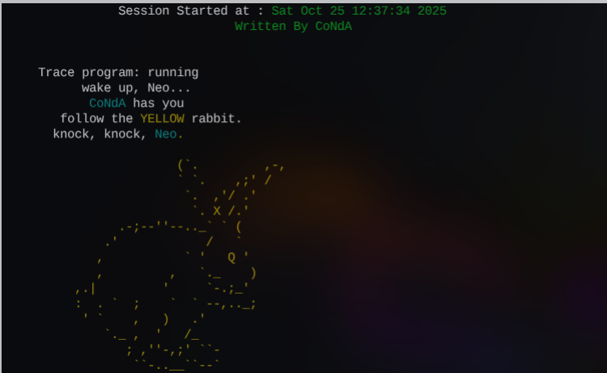
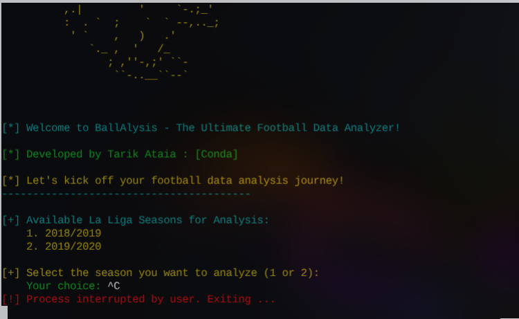
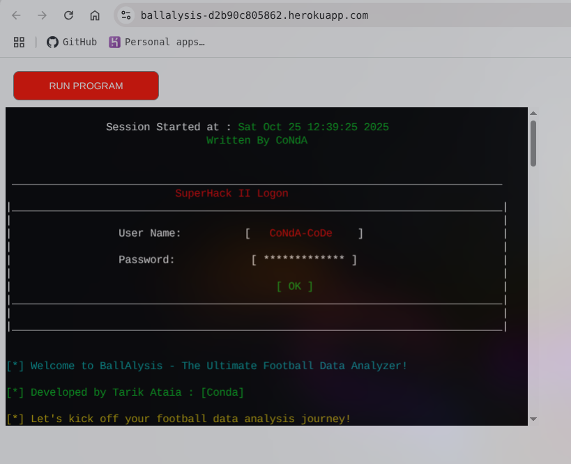
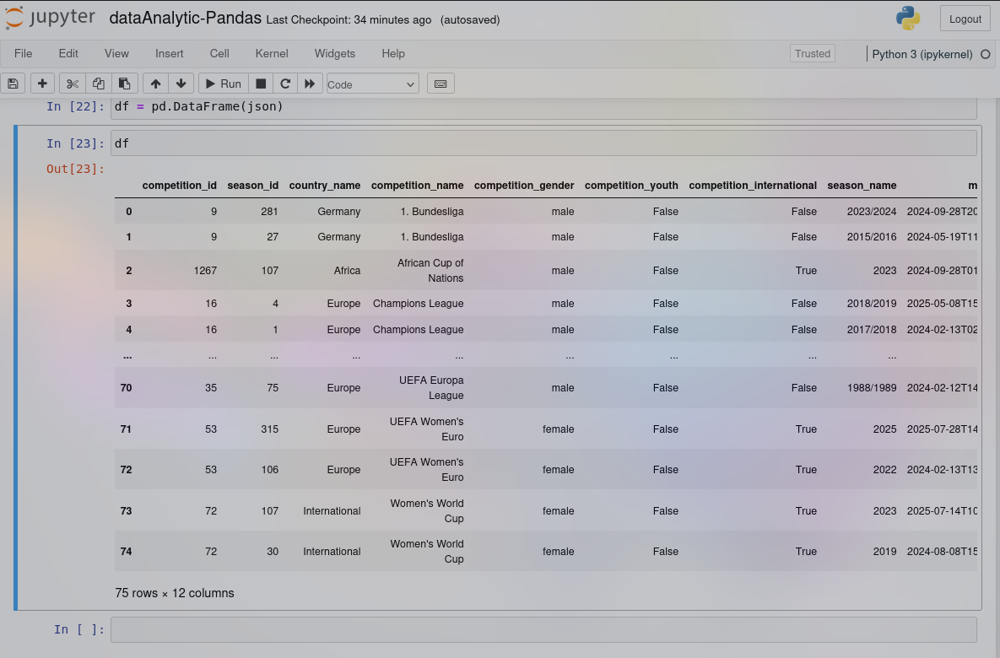
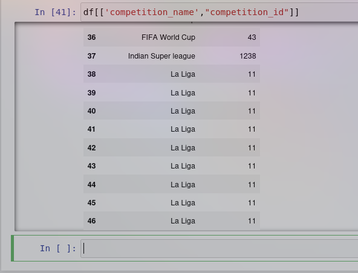

# ⚽ Team Analyzer


**Team Analyzer** is a Python-based interactive CLI tool designed to fetch, process, and analyze football match data from a public API.  

It combines clean data presentation with a visually engaging terminal interface for a smoother user experience.  

The project has been successfully **deployed on Heroku** and is fully operational.


> 🧾 **Note on Project Structure:**  

> The project consists of three main Python files:

> - `banners.py` → An old file reused and updated to enhance the **user experience (UX)** through terminal banners and colored messages.  

While not essential to the core logic, it enhances the visual and interactive aspects of the tool.  

> - `analyzer.py` → Contains the **main analytical logic**, API handling, and data processing.  

> - `run.py` → Acts as the **entry point**, managing execution flow and user interaction.

>

> The focus of the technical evaluation should mainly be on `analyzer.py` and `run.py`,  

> as they represent the functional backbone of the application.


---


## 🧭 Table of Contents
1. [Overview](#overview)  
2. [Features](#features)  
3. [Installation](#installation)  
4. [Usage](#usage)  
5. [Testing](#testing)  
6. [Code Files Overview](#code-files-overview)  
7. [Code Quality](#code-quality)  
8. [Future Improvements](#future-improvements)  
9. [Credits](#credits)  
10. [License](#license)


---


## 🧩 Overview

**Team Analyzer** fetches football match data, processes it using **Pandas**, and displays it with a clean CLI interface.  

It’s designed to be both informative and easy to use, providing a starting point for football data analytics.  






---


## ✨ Features

- Fetches real football data from free external API "StatsBomb",
- Link : https://github.com/statsbomb/open-data
- Displays formatted and colorized statistics for teams and matches.
- Provides random ASCII banners to improve user experience.
- Error-handling and smooth CLI interactions.  
- Fully deployed and functional on **Heroku**.




---


## ⚙️ Installation

Clone the repository and install dependencies:
```bash
git clone https://github.com/Tarik-Box/Team-Analyzer.git
cd Team-Analyzer
pip install -r requirements.txt

```

## ▶️ Usage :

```bash
python run.py

```

Or try the deployed version on Heroku:

- Link : https://ballalysis-d2b90c805862.herokuapp.com/


---


## 🧪 Testing

Manual testing steps:

Launch the script 'python3 run.py' , and select the season to analyze 

Select a match / Teams from the list.

Observe the displayed statistics for accuracy.

Interrupt using Ctrl + C to verify proper exit handling.

Use Jupyter Notebook to explore the loaded JSON → DataFrame transformation.






---


## 🧱 Code Files Overview


➤ banners.py

Contains old ASCII-art banners reused to enhance user experience.

Updated with color formatting and basic text animations.

Not directly tied to business logic.

Example of a file kept for legacy + aesthetic purposes.

---

➤ analyzer.py

Core logic for retrieving, parsing, and displaying football data.

Implements API calls, error handling, and JSON → DataFrame conversion.

Ensures data is formatted and displayed in an organized manner for analysis.

---

➤ run.py

The entry point of the program.

Handles main execution flow and interaction between modules.

Launches the CLI and calls the analyzer functions.

Designed for smooth execution and easy debugging.


---


## 🧼 Code Quality

Almost all PEP 8 and Flake8 warnings have been resolved, except for unavoidable line-length issues (mainly within banner strings).
The code now follows a consistent style and is organized into logical, readable modules.


---


## 🚀 Future Improvements

Currently, the project retrieves and analyzes match data mainly from the Spanish La Liga.

Future versions could detect and list all available leagues from the API for user selection.

With a richer API, the tool could evolve into a more advanced analytics platform with visual dashboards.

Expansion to include additional metrics (e.g., player performance tracking).

Improved handling for API rate limits and missing data scenarios.


---


## 🙌 Credits

Special thanks to:

### Resources -

- Corey Schafer (YouTube) — for his excellent tutorials on pandas and clean coding practices.

➤ [Playlist](https://www.youtube.com/watch?v=ZyhVh-qRZPA&list=PLSLQ7uyfNIItZf404-TviaeM01pnebr5K)

- Statsbomb free open data - API 

➤ [Statsbomb](https://github.com/statsbomb/open-data)

### AI Assistants -

➤ ChatGPT (OpenAI) — for assistance in structuring and refining the README file.

➤ GitHub Copilot (VS Code) — for autocompletion and in-line code comments.


---


## 📄 License

Free, public, and open-source for educational and personal use.